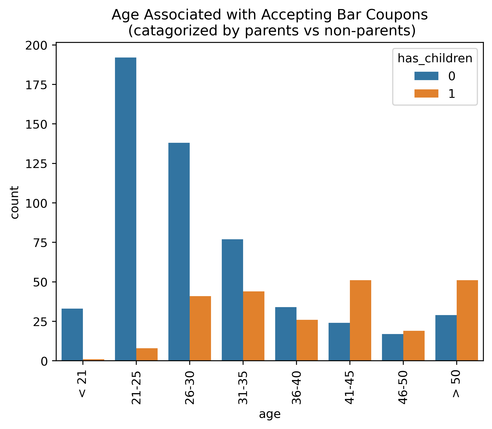
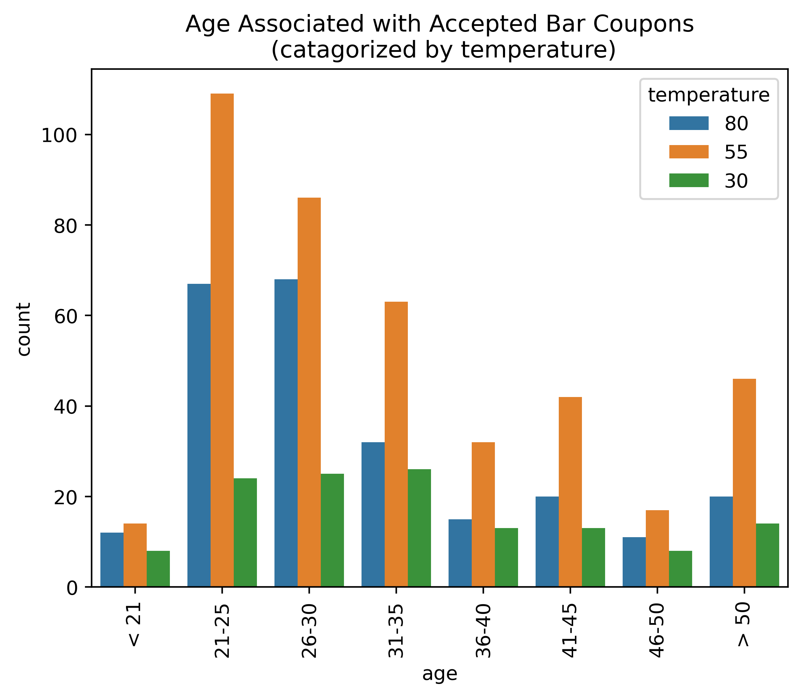

# module-5
### Diagnosing Usage of Bar Coupons by a Driver Who has received the coupon via their Phone

## Observations:

Only 785 drivers used the bar coupons out of 1906 who received them.
# Out of the 785 drivers the demographics were observed
Top 4 Income: 
- $25000 - $37499     136
- $100000 or More     134
- $12500 - $24999     114
- $50000 - $62499     101

Top 4 Occupation:
- Student                       114
- Unemployed                    87
- Computer & Mathematical       79
- Sales & Related               78

It was difficult for me to accept the data regarding occupation in relation to income being that there were students and unemployed drivers shown as making $100,000 which didn't make any sense.  I could have filtered out those data points and used some of the student data but being that most students are potentially under the age of 21 I would think a retail business like a bar, which has age restrictions, would want to remove that demographic any way for legal reasons.  Furthermore, with regards to age people >=21 and < 36 did the bulk of the accepting anyway so not being able to use the "Student" demographic was really a non-issue.

There seemed to be a strong acceptant when looking at drivers in specific age groups that were non-parents vs parents
Parental status (has_children)
- Parents       241
- non parents   544 

With that observation age was another data point where driver's between the ages 35 and 21 seemed to accept coupons more often then not.  Especially when they did not have parental responsibilities

Total bar coupons accepted when associated with a driver's age

Top 4 Age groups:
- 21-25    200
- 26-30    179
- 31-35    121

Another good target scenario that I observed was when I associated the driver's "destination" and "outside temperature".  It was noted that as temperatures went up and the driver had no real urgency to go anywhere, the bar seemed to be the place of choice.  Similarly it was seen that when the temperature was not too hot and not too cold (55 deg), regardless of urgency, drivers tended to accept the bar coupon more often then not.  I was able to observe this from the folling bar chart.

## Hypothesis

After seeing the effect of temperature I decided to compare that with age.  Here it was observed the driver's between the ages of 21 and 30 accepted bar coupons the most over any other relation.  However, this same behavior was exibited during moderate temperatures as show in the following diagram.

This would suggest a possible correlation between the two where when temperatures were 55 degrees similar behavior could be expected when dealing with specific age groups when drivers were not parents.  Unfortunately, given the nature of the dataset I was not able to prove any correlation actually existed.
